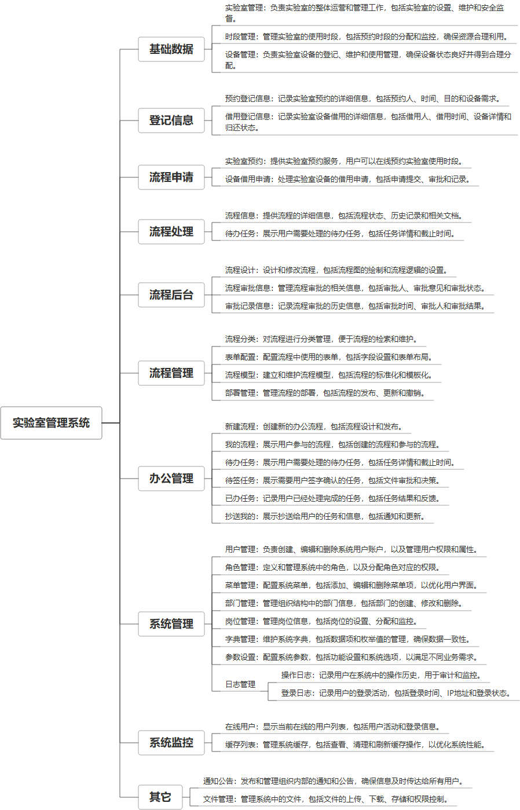

 

    
 

公司拥有上百套具有自主知识产权的软件系统，详情请查看码云首页或公司官网

 
<h1>实验室管理系统</h1>

<a href="https://www.haishi.net.cn/">公司官网</a> ｜ <a href="https://www.haishi.net.cn/">在线体验</a>

 

## 系统介绍

实验室管理系统是一款集实验室资源管理、设备借用、预约登记、流程审批于一体的智能化管理平台，包含管理端和H5端。系统为管理端提供了实验室、设备、预约登记、借用登记的查询、新增、修改、删除及导出功能，同时支持流程设计、审批信息、审批记录的管理。H5端则方便用户进行实验室预约申请、设备借用申请，并支持查看申请详情、取消申请等操作。此外，系统还具备时段管理、待办任务处理、设备借用申请查看等功能，确保实验室资源的高效利用和精细化管理。
实验室管理系统是一款集实验室资源管理、设备借用、预约登记、流程审批于一体的智能化管理平台，包含管理端和H5端。系统为管理端提供了实验室、设备、预约登记、借用登记的查询、新增、修改、删除及导出功能，同时支持流程设计、审批信息、审批记录的管理。H5端则方便用户进行实验室预约申请、设备借用申请，并支持查看申请详情、取消申请等操作。此外，系统还具备时段管理、待办任务处理、设备借用申请查看等功能，确保实验室资源的高效利用和精细化管理。
本项目名称为实验室管理系统，旨在实现实验室资源的全面管理，包括实验室、时段、设备的管理，以及实验预约、设备借用等流程的自动化处理。该系统提供登记信息管理、流程申请、流程处理、流程后台管理、办公管理和系统管理等功能模块，方便实验室管理员、实验人员以及其他相关人员进行实验室资源的有效管理和利用。
本项目包含一个终端：实验室管理系统Web端。
- 实验室管理系统Web端：实验室管理员、实验人员和其他相关人员使用，可以进行实验室管理、时段管理、设备管理、预约登记、借用登记、流程申请、流程处理、流程设计、流程审批、用户管理、角色管理、部门管理等操作。
                

## 系统功能介绍

### 系统包含终端说明

管理端（WEB）

| 序号 | 模块 | 模块说明 |
| --- | --- | --- |
| 1 | GC-SYSFZ-YYXT-SERVER | 服务端 |
| 2 | GC-SYSFZ-YYXT-MANAGE | 管理端 |

### 系统功能结构

### 系统功能说明

主要功能：
* **实验室管理:** 管理实验室资源，包括实验室的新增、修改、删除等操作。
* **设备管理:** 管理实验室设备，包括设备的新增、修改、删除、维护记录等操作。
* **预约登记:** 实验人员进行实验室预约登记，包括选择实验室、时段、实验项目等信息。
* **流程申请:** 实验人员提交实验预约、设备借用等流程申请。
* **流程处理:** 实验室管理员对流程申请进行审批、处理。
* **流程设计:** 管理员可以自定义流程，例如设置审批节点、审批人等。
* **用户管理:** 管理系统用户，包括用户的添加、删除、权限设置等操作。

## 系统主要界面

## 系统技术说明

### 代码模块说明

| 序号 | 目录 | 目录说明 |
| --- | --- | --- |
| 1 | GC-SYSFZ-YYXT-SERVER/sd | -- |
| 2 | GC-SYSFZ-YYXT-SERVER/ruoyi-demo | -- |
| 3 | GC-SYSFZ-YYXT-SERVER/ruoyi-oss | -- |
| 4 | GC-SYSFZ-YYXT-SERVER/ruoyi-flowable | -- |
| 5 | GC-SYSFZ-YYXT-SERVER/ruoyi-job | -- |
| 6 | GC-SYSFZ-YYXT-SERVER/ruoyi-generator | -- |
| 7 | GC-SYSFZ-YYXT-SERVER/ruoyi-extend | -- |
| 8 | GC-SYSFZ-YYXT-SERVER/ruoyi-sms | -- |
| 9 | GC-SYSFZ-YYXT-SERVER/ruoyi-framework | -- |
| 10 | GC-SYSFZ-YYXT-SERVER/ruoyi-common | -- |
| 11 | GC-SYSFZ-YYXT-SERVER/ruoyi-system | -- |
| 12 | GC-SYSFZ-YYXT-SERVER/.run | -- |
| 13 | GC-SYSFZ-YYXT-SERVER/ruoyi-admin | -- |
| 14 | GC-SYSFZ-YYXT-SERVER/.idea | -- |

### 系统技术选型

#### 开发语言/框架

JAVA（JDK1.8）
前端框架：VUE2
脚手架：RuoYi

#### 服务中间件

Nginx
Tomcat

#### 数据库

MySQL（5.7+）
Redis

#### 其他说明

无

## 系统演示/商用

请扫码添加客服微信获取演示地址和系统详细资料。

如果您想基于实验室管理系统进行商业化交付或定制开发服务，我们提供有偿的技术服务支持，合作模式不限，欢迎沟通！

公司官网地址： <a href="https://www.haishi.net.cn/">https://www.haishi.net.cn</a>

联系客服获取专业回答。

## 使用须知

1、 本项目商用必须获得版权所有者的授权。

2、 未经允许本项目代码不允许二次出售。

